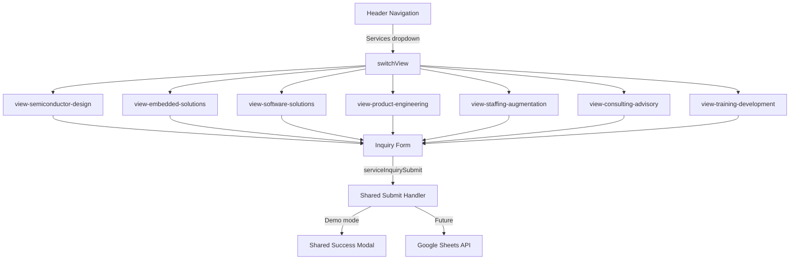

# Design Document: Services Pages with Inquiry Forms

## Overview

This feature adds seven dedicated service pages to the existing Rycene VLSI single-page application (SPA). Each page presents marketing content for an Avecas service category and includes an inquiry form. The implementation extends the existing view-switching architecture, reuses the glassmorphism design system, and introduces a shared inquiry form handler with a single reusable success modal.

The site is a single `index.html` file (~4930 lines). All new HTML, CSS, and JavaScript will be added inline to that file, following the established pattern for every other view.

### Key Design Decisions

- **Single shared success modal** — one modal element is dynamically populated with the service name at submission time, rather than seven separate modals. This keeps the DOM lean and the behavior consistent.
- **Shared `serviceInquirySubmit()` handler** — one JavaScript function handles all seven forms, parameterized by `formId` and `serviceName`. This makes future Google Sheets integration a one-line change.
- **Services data array** — a `servicesData` array drives both the navigation dropdown and the page content, making it easy to add or modify services without touching markup.
- **Demo mode by default** — no real network calls are made. A `setTimeout` of 800 ms simulates latency. The Google Sheets `fetch` call is present but commented out, ready to activate.
- **Services dropdown in nav** — a hover/click dropdown is added to the desktop nav and an expandable section to the mobile menu, keeping the existing nav structure intact.

---

## Architecture

### SPA View Integration

The existing `switchView(viewName)` function maintains an `allViews` array. Seven new view IDs are appended to it:

```
'semiconductor-design', 'embedded-solutions', 'software-solutions',
'product-engineering', 'staffing-augmentation', 'consulting-advisory',
'training-development'
```

Each service view is a `<div id="view-{id}" class="hidden-view pt-24 pb-12 min-h-screen">` element placed inside `<main>`, after the existing `view-refund` div and before the closing `</main>` tag.

The `switchView` function already handles scroll-to-top, body overflow reset, and background canvas toggling. Service views will use the same canvas-visible behavior as `home`, `details`, `enroll`, and `contact`.

### Navigation Integration

A **Services dropdown** is inserted into the desktop nav between the "Team & Mission" anchor and the "Contact Us" button. On mobile, a collapsible "Services" section is added to the existing `#mobile-dropdown` div.

```
Desktop nav order:
  Home | Courses | Team & Mission | Services ▾ | Contact Us

Mobile dropdown order:
  Home | Courses | Team & Mission | Services (expandable) | Contact Us
```

### Data Flow

```
servicesData[]
    │
    ├─► Navigation dropdown (rendered on DOMContentLoaded)
    │
    └─► Service page views (static HTML, one per service)
            │
            └─► Inquiry form
                    │
                    └─► serviceInquirySubmit(formId, serviceName)
                                │
                                ├─► Demo: setTimeout(800ms) → showServiceSuccessModal(serviceName)
                                └─► Production (commented): fetch(scriptURL, formData)
```

### High-Level Component Diagram



---

## Components and Interfaces

### 1. Services Data Structure

Defined as a `const servicesData` array in the `<script>` block, before `DOMContentLoaded`:

```javascript
const servicesData = [
  {
    id: 'semiconductor-design',
    title: 'Semiconductor Design',
    icon: 'fas fa-microchip',
    description: 'End-to-end semiconductor design services...',
    accentColor: 'cyan',       // maps to btn-glass-primary / cyan CSS vars
    subCategories: [
      { title: 'Front-End Design', icon: 'fas fa-code', description: '...' },
      { title: 'Back-End Design',  icon: 'fas fa-layer-group', description: '...' },
      { title: 'Analog Design',    icon: 'fas fa-wave-square', description: '...' },
      { title: 'Design for Testability (DFT)', icon: 'fas fa-vial', description: '...' },
      { title: 'IP & SoC Design Services',     icon: 'fas fa-puzzle-piece', description: '...' },
      { title: 'EDA & CAD Services',           icon: 'fas fa-tools', description: '...' },
      { title: 'Post-Silicon & Technology Engineering', icon: 'fas fa-flask', description: '...' },
    ]
  },
  // ... 6 more services
];
```

`accentColor` values map to existing CSS variable sets:
- `cyan` → `--accent-cyan` / `btn-glass-primary`
- `purple` → `--accent-purple` / `btn-glass-purple`
- `orange` → `--accent-orange` / `btn-glass-orange`

Color assignments per service:
| Service | accentColor |
|---|---|
| Semiconductor Design | cyan |
| Embedded Solutions | purple |
| Software Solutions | cyan |
| Product Engineering | orange |
| Staffing & Augmentation | purple |
| Consulting & Advisory | cyan |
| Training & Development | orange |

### 2. Services Navigation Dropdown

**Desktop** — a new `<div class="relative group">` wrapper around a "Services" nav-btn. The dropdown panel appears on hover via CSS (`group-hover:block`) and contains links for all seven services.

```html
<div class="relative group" id="services-nav-wrapper">
  <button class="nav-btn flex items-center gap-1" aria-haspopup="true" aria-expanded="false"
          id="services-nav-btn">
    Services <i class="fas fa-chevron-down text-xs transition-transform group-hover:rotate-180"></i>
  </button>
  <div id="services-dropdown"
       class="hidden group-hover:block absolute top-full left-0 mt-1 w-64 rounded-xl
              bg-black/95 border border-white/10 backdrop-blur-xl shadow-2xl py-2 z-50">
    <!-- one button per service, generated by JS -->
  </div>
</div>
```

**Mobile** — a collapsible section inside `#mobile-dropdown`:

```html
<div>
  <button id="services-mobile-toggle"
          class="block w-full text-left nav-btn py-3 px-4 rounded-lg hover:bg-white/5 flex justify-between items-center">
    Services <i class="fas fa-chevron-down text-xs" id="services-mobile-chevron"></i>
  </button>
  <div id="services-mobile-submenu" class="hidden pl-4 space-y-1 mt-1">
    <!-- one button per service, generated by JS -->
  </div>
</div>
```

Both menus are populated by iterating `servicesData` on `DOMContentLoaded`.

### 3. Service Page View Layout

Each service view follows this structure:

```
view-{id}
├── Back to Home button
├── Service Hero Section
│   ├── Icon + Title (text-4xl, text-3d-steel)
│   └── Description paragraph
├── Sub-Categories Grid (glass-card grid)
│   └── card × N  (icon, title, description)
└── Inquiry Form Section
    ├── Section heading ("Get in Touch")
    └── form#inquiry-{id}
        ├── hidden input[name="service"] value="{title}"
        ├── Full Name *
        ├── Email Address *
        ├── Phone Number
        ├── Company Name
        ├── Message *
        └── Submit button
```

The sub-categories grid uses responsive Tailwind classes:
- Mobile: `grid-cols-1`
- Tablet (≥768px): `grid-cols-2`
- Desktop (≥1024px): `grid-cols-3` (or `grid-cols-2` for services with ≤4 sub-categories)

### 4. Inquiry Form

Each form has a unique `id="inquiry-{service-id}"` and a `data-service-name="{title}"` attribute. The submit button calls `serviceInquirySubmit('inquiry-{id}', '{title}')`.

Field specification:

| Field | Element | `name` attr | `type` | Required |
|---|---|---|---|---|
| Full Name | `<input>` | `fullName` | `text` | ✓ |
| Email Address | `<input>` | `email` | `email` | ✓ |
| Phone Number | `<input>` | `phone` | `tel` | — |
| Company Name | `<input>` | `company` | `text` | — |
| Service Interest | `<input hidden>` | `service` | `hidden` | — |
| Message | `<textarea>` | `message` | — | ✓ |

All visible inputs use `class="form-input w-full rounded-md p-3 text-white"`. Labels use `<label for="{id}" class="block text-xs text-slate-400 mb-1">`. Required fields show `<span class="text-red-400 ml-1">*</span>` in the label.

### 5. Shared Submit Handler

```javascript
window.serviceInquirySubmit = function(formId, serviceName) {
  const form = document.getElementById(formId);
  if (!form || !form.checkValidity()) {
    form.reportValidity();
    return;
  }

  const submitBtn = form.querySelector('[type="submit"]');
  // Loading state
  submitBtn.disabled = true;
  submitBtn.innerHTML = '<i class="fas fa-spinner fa-spin mr-2"></i>Sending...';

  // --- DEMO MODE ---
  setTimeout(() => {
    submitBtn.disabled = false;
    submitBtn.innerHTML = originalBtnText;
    showServiceSuccessModal(serviceName);
    form.reset();
  }, 800);

  // --- PRODUCTION (commented out) ---
  // const scriptURL = 'YOUR_GOOGLE_SHEETS_SCRIPT_URL';
  // const formData = new FormData(form);
  // fetch(scriptURL, { method: 'POST', body: formData })
  //   .then(() => { showServiceSuccessModal(serviceName); form.reset(); })
  //   .catch(() => { showServiceErrorMessage(formId); })
  //   .finally(() => { submitBtn.disabled = false; submitBtn.innerHTML = originalBtnText; });
};
```

### 6. Shared Success Modal

One modal element is added to the DOM (after the existing modals, before `</body>`):

```html
<div id="service-inquiry-modal" class="modal hidden fixed inset-0 z-[100] flex items-center justify-center p-4">
  <div class="modal-backdrop absolute inset-0 bg-black/70 backdrop-blur-sm"></div>
  <div class="relative z-10 max-w-md w-full rounded-2xl border border-white/10
              bg-slate-900/95 backdrop-blur-xl shadow-2xl p-8 text-center
              animate-modal-in">
    <div class="w-16 h-16 rounded-full bg-green-500/20 border border-green-500/30
                flex items-center justify-center mx-auto mb-4">
      <i class="fas fa-check text-green-400 text-2xl"></i>
    </div>
    <h3 class="text-2xl font-bold text-white mb-2">Thank You!</h3>
    <p class="text-slate-300 mb-1">Your inquiry has been received.</p>
    <p id="service-modal-service-name" class="text-cyan-400 font-semibold mb-6"></p>
    <p class="text-slate-400 text-sm mb-6">Our team will get back to you within 1-2 business days.</p>
    <button class="modal-close-btn btn-glass btn-glass-primary w-full py-3 rounded-xl font-semibold">
      Close
    </button>
  </div>
</div>
```

`showServiceSuccessModal(serviceName)` sets `#service-modal-service-name` text to `"Service: {serviceName}"` then removes the `hidden` class. The existing `modal-close-btn` / `modal-backdrop` event delegation already handles closing.

---

## Data Models

### Service Object

```typescript
interface ServiceSubCategory {
  title: string;       // e.g. "Front-End Design"
  icon: string;        // Font Awesome class, e.g. "fas fa-code"
  description: string; // 1-2 sentence marketing description
}

interface Service {
  id: string;           // kebab-case, matches view ID suffix, e.g. "semiconductor-design"
  title: string;        // Display name, e.g. "Semiconductor Design"
  icon: string;         // Font Awesome class for hero icon
  description: string;  // Hero section paragraph (2-3 sentences)
  accentColor: string;  // "cyan" | "purple" | "orange"
  subCategories: ServiceSubCategory[];
}
```

### Form Submission Payload (future Google Sheets)

```javascript
{
  fullName:    string,   // required
  email:       string,   // required, validated as email
  phone:       string,   // optional
  company:     string,   // optional
  service:     string,   // hidden, pre-filled with service title
  message:     string,   // required
  timestamp:   string,   // added by handler: new Date().toISOString()
}
```

The `name` attributes on form fields match these keys exactly so `new FormData(form)` produces the correct payload for Google Sheets without any transformation.

---

## Correctness Properties

*A property is a characteristic or behavior that should hold true across all valid executions of a system — essentially, a formal statement about what the system should do. Properties serve as the bridge between human-readable specifications and machine-verifiable correctness guarantees.*

Property-based testing applies here because the feature has a `servicesData` array that drives both navigation and page content. Many behaviors must hold universally across all 7 services, making them ideal candidates for property-based tests with generated inputs. The recommended PBT library is **fast-check** (JavaScript).

### Property 1: View exclusivity on navigation

*For any* service ID in `servicesData`, after calling `switchView(service.id)`, the view element `#view-{service.id}` must not have the `hidden-view` class, and every other view in `allViews` must have the `hidden-view` class.

**Validates: Requirements 2.2, 9.1**

### Property 2: Back button navigates home

*For any* service page view, there must exist at least one button/link element that, when clicked, calls `switchView('home')`, resulting in `#view-home` being visible and `#view-{service.id}` being hidden.

**Validates: Requirements 2.3**

### Property 3: Service page renders title and description

*For any* service object in `servicesData`, the corresponding view element must contain the service's `title` text and `description` text in its inner HTML.

**Validates: Requirements 3.1, 3.2**

### Property 4: All sub-categories are rendered

*For any* service object in `servicesData` that has a non-empty `subCategories` array, every sub-category `title` in that array must appear in the corresponding view element's inner HTML.

**Validates: Requirements 3.3, 13.1–13.7**

### Property 5: Inquiry form fields are present for every service

*For any* service in `servicesData`, the form `#inquiry-{service.id}` must contain: an `input[type="text"][name="fullName"]`, an `input[type="email"][name="email"]`, an `input[name="phone"]`, an `input[name="company"]`, a `textarea[name="message"]`, and an `input[type="hidden"][name="service"]` whose value equals the service title.

**Validates: Requirements 4.1, 4.2, 14.1–14.3**

### Property 6: Form title includes service name

*For any* service in `servicesData`, the inquiry form section heading within `#view-{service.id}` must contain the service's `title` string.

**Validates: Requirements 4.3**

### Property 7: Submit handler shows success modal with correct service name

*For any* service name string passed to `showServiceSuccessModal(serviceName)`, the `#service-inquiry-modal` element must not have the `hidden` class after the call, and the `#service-modal-service-name` element's text content must include `serviceName`.

**Validates: Requirements 7.2, 7.3**

### Property 8: Modal close resets form and restores scroll

*For any* open `#service-inquiry-modal` state, after the close action is triggered (close button click or backdrop click), the modal must have the `hidden` class, `document.body.style.overflow` must not be `"hidden"`, and all input/textarea values in the associated inquiry form must be empty strings.

**Validates: Requirements 8.1, 8.2, 8.4, 8.5**

### Property 9: Submit button enters loading state during submission

*For any* service inquiry form with valid data, immediately after `serviceInquirySubmit` is called (before the 800 ms timeout resolves), the submit button must be `disabled` and its text content must indicate a loading state (e.g., contain "Sending" or a spinner element).

**Validates: Requirements 6.4, 6.5**

### Property 10: Error state preserves form data

*For any* service inquiry form submission that results in an error, all previously entered field values must remain unchanged in the form, the submit button must be re-enabled, and an error message element must be visible within the form container.

**Validates: Requirements 15.1, 15.4, 15.5**

---

## Error Handling

### Form Validation Errors

HTML5 native validation (`required`, `type="email"`) is the first line of defense. `form.checkValidity()` is called in `serviceInquirySubmit` before any async work begins. If invalid, `form.reportValidity()` triggers browser-native error bubbles and the function returns early — no loading state is entered.

### Submission Errors (Demo Mode)

In demo mode, errors are simulated by a flag for testing purposes. In production mode (when the `fetch` call is active), the `.catch()` handler calls `showServiceErrorMessage(formId)`:

```javascript
function showServiceErrorMessage(formId) {
  const form = document.getElementById(formId);
  let errorEl = form.querySelector('.inquiry-error-msg');
  if (!errorEl) {
    errorEl = document.createElement('div');
    errorEl.className = 'inquiry-error-msg mt-3 p-3 rounded-lg bg-red-500/10 border border-red-500/30 text-red-400 text-sm';
    errorEl.setAttribute('role', 'alert');
    form.appendChild(errorEl);
  }
  errorEl.textContent = 'Something went wrong. Please try again or contact us directly.';
  errorEl.classList.remove('hidden');
}
```

The error element uses `role="alert"` so screen readers announce it immediately. The submit button is re-enabled in the `finally` block. Entered form data is preserved (no `form.reset()` on error).

### View Not Found

`switchView` already handles missing view elements gracefully (null check on `targetView`). No additional handling needed.

### Modal State Consistency

The success modal is always reset before showing: `#service-modal-service-name` text is set, then `hidden` is removed. This prevents stale service names from a previous submission appearing if the modal is opened rapidly.

---

## Testing Strategy

### Unit / Example-Based Tests

Use **Jest** with **jsdom** for DOM-based unit tests. These cover specific structural and behavioral examples:

- Verify `allViews` array contains all 7 service IDs after the update
- Verify each service form has `required` attributes on mandatory fields
- Verify `input[type="email"]` is present on the email field of each form
- Verify the success modal contains a close button
- Verify `serviceInquirySubmit` does not call `fetch` in demo mode (mock `window.fetch`)
- Verify Escape key listener closes the modal
- Verify semantic HTML: each service view uses `<section>`, `<form>`, `<button>` elements
- Verify `<label for="...">` associations match input `id` attributes

### Property-Based Tests

Use **fast-check** with Jest. Each property test runs a minimum of **100 iterations**.

Tag format for each test: `// Feature: services-pages-with-inquiry-forms, Property {N}: {property_text}`

Properties to implement as PBT tests:

| Property | fast-check Arbitrary | What varies |
|---|---|---|
| P1: View exclusivity | `fc.constantFrom(...servicesData.map(s => s.id))` | Which service is activated |
| P2: Back button navigates home | `fc.constantFrom(...servicesData)` | Which service page |
| P3: Title and description rendered | `fc.constantFrom(...servicesData)` | Which service |
| P4: All sub-categories rendered | `fc.constantFrom(...servicesData.filter(s => s.subCategories.length > 0))` | Which service |
| P5: Form fields present | `fc.constantFrom(...servicesData)` | Which service form |
| P6: Form title includes service name | `fc.constantFrom(...servicesData)` | Which service |
| P7: Success modal shows correct name | `fc.string({ minLength: 1 })` | Any service name string |
| P8: Modal close resets form | `fc.constantFrom(...servicesData)` | Which service form |
| P9: Loading state during submit | `fc.constantFrom(...servicesData)` | Which service form |
| P10: Error preserves form data | `fc.record({ fullName: fc.string(), email: fc.emailAddress(), message: fc.string() })` | Form field values |

### Integration / Smoke Tests

Manual verification checklist (not automated):

- All 7 service pages render correctly in Chrome, Firefox, Safari
- Mobile viewport (375px): single-column layout, hamburger menu works, services submenu expands
- Tablet viewport (768px): two-column sub-category grid
- Desktop viewport (1280px): three-column sub-category grid, dropdown nav works on hover
- AOS scroll animations trigger on service page content
- Background canvas (`#logic-gate-background`) is visible on service pages
- Success modal animation (fade + scale) plays correctly
- Form submission flow end-to-end: fill → submit → loading → success modal → close → form reset
- Keyboard navigation: Tab through form fields, Enter submits, Escape closes modal
- Screen reader: labels announced, error messages announced via `role="alert"`

### CSS Additions Required

New CSS classes to add in the `<style>` block:

```css
/* Services dropdown */
.services-dropdown-item {
  display: block;
  width: 100%;
  text-align: left;
  padding: 0.625rem 1rem;
  color: var(--text-secondary);
  font-size: 0.875rem;
  font-weight: 500;
  transition: all 0.2s ease;
  border-radius: 0.5rem;
}
.services-dropdown-item:hover {
  color: var(--text-primary);
  background: rgba(255, 255, 255, 0.05);
}

/* Service page hero icon */
.service-hero-icon {
  width: 4rem;
  height: 4rem;
  border-radius: 1rem;
  display: flex;
  align-items: center;
  justify-content: center;
  font-size: 1.75rem;
  margin-bottom: 1.5rem;
}

/* Success modal entrance animation */
@keyframes modalScaleIn {
  from { opacity: 0; transform: scale(0.9) translateY(10px); }
  to   { opacity: 1; transform: scale(1) translateY(0); }
}
.animate-modal-in {
  animation: modalScaleIn 0.25s cubic-bezier(0.4, 0, 0.2, 1) forwards;
}

/* Inquiry error message */
.inquiry-error-msg {
  margin-top: 0.75rem;
  padding: 0.75rem;
  border-radius: 0.5rem;
  background: rgba(239, 68, 68, 0.1);
  border: 1px solid rgba(239, 68, 68, 0.3);
  color: #f87171;
  font-size: 0.875rem;
}

/* Service sub-category card accent line */
.service-card-accent-cyan  { border-top: 2px solid rgba(34, 211, 238, 0.5); }
.service-card-accent-purple { border-top: 2px solid rgba(167, 139, 250, 0.5); }
.service-card-accent-orange { border-top: 2px solid rgba(251, 146, 60, 0.5); }
```

### Responsive Breakpoints

Matching the existing mobile patterns in `index.html`:

| Breakpoint | Sub-category grid | Nav behavior |
|---|---|---|
| < 768px | `grid-cols-1` | Services in mobile dropdown (collapsible) |
| 768px – 1023px | `grid-cols-2` | Desktop nav with dropdown |
| ≥ 1024px | `grid-cols-3` | Desktop nav with dropdown |

Form fields stack vertically at all breakpoints (already the default with `w-full` inputs). The success modal uses `max-w-md w-full` with `p-4` padding on the outer container, ensuring it fits on 320px screens.
